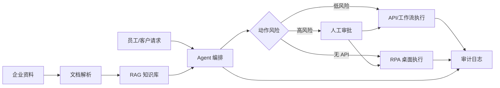

# SME AI Automation

面向中小企业的 AI 落地方案库：用 RAG 企业知识库、工作流自动化、RPA 和 AI Agent 替代人工重复操作。

这个仓库先做一件事：把传统企业的重复流程拆成可评估、可交付、可审计的自动化方案。不要一开始就造大平台。

## 目标

- 把企业散落在文档、表格、系统和聊天记录里的知识接入 RAG。
- 把人工重复操作拆成 API、工作流、RPA、人工审批四类动作。
- 用 Agent 做判断和编排，但高风险动作必须留审批、日志和回滚。
- 优先服务销售、客服、财务、人事、采购、运营这些重复劳动密集场景。

## MVP 范围

第一版只交付三个闭环：

1. 企业知识库问答：上传制度、产品资料、SOP、FAQ，回答必须带来源。
2. 表单/邮件/表格处理：抽取结构化字段，生成待办或草稿。
3. 半自动流程执行：Agent 给出动作计划，人确认后调用 API 或 RPA 执行。

## 推荐架构



## 文档

- [产品落地页](public/index.html)
- [调研结论](docs/research.md)
- [产品方案](docs/product-plan.md)
- [架构设计](docs/architecture.md)
- [落地路线](docs/roadmap.md)
- [安全与密钥](docs/security.md)

## 技术原则

- 先工作流，后 Agent。确定性流程不用大模型硬做。
- 先 API，后 RPA。RPA 只处理老系统、网页后台、无接口软件。
- 先人工确认，后自动执行。财务、合同、客户数据变更默认需要审批。
- 先开源模板，后行业插件。不要提前为每个行业造抽象。

## 本地开发

```powershell
copy .env.example .env
```

真实密钥只放 `.env` 或父目录的 `secrets/`，不要提交。
