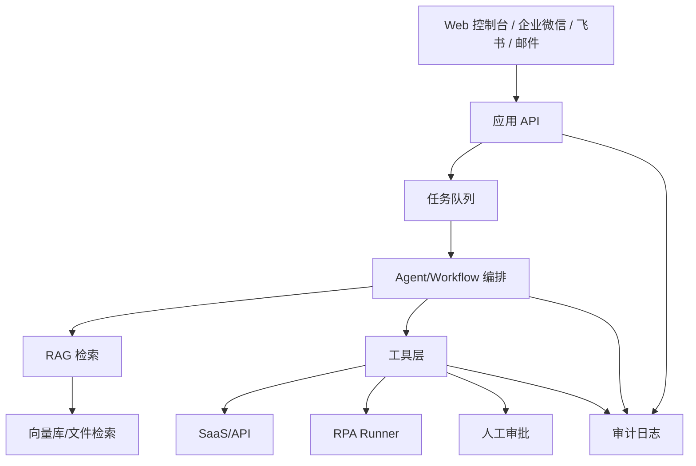

# 架构设计

## 分层

## RAG 设计

- 文档来源：PDF、Word、Excel、网页、FAQ、SOP、聊天记录导出。
- 元数据：客户、部门、文档类型、版本、有效期、权限级别。
- 检索：MVP 用托管 file search；自托管版用 hybrid search。
- 回答：必须返回来源片段；没有来源时回答“不确定”。
- 更新：按客户/部门分库或分 namespace，避免跨客户污染。

## Agent 设计

Agent 只做三件事：

1. 判断任务类型。
2. 调用 RAG 或工具补齐上下文。
3. 生成可执行计划，并按风险级别执行或请求审批。

低风险动作可以自动执行：查资料、生成草稿、创建待办、发送内部提醒。

高风险动作必须审批：付款、合同、删除数据、修改客户关键字段、对外发送正式文件。

## RPA 设计

RPA 是最后手段，用于没有 API 的老系统。

- 每个 RPA 动作要有输入 schema、截图/日志、超时、失败重试。
- 密码、验证码、支付、删除动作默认人工接管。
- RPA 脚本不和 Agent 混在一起，Agent 只调用受控的 runner。

## 数据表最小模型

| 表 | 作用 |
| --- | --- |
| organizations | 企业/客户 |
| documents | 文档元数据 |
| tasks | 进入系统的工作项 |
| tool_runs | API/RPA/审批执行记录 |
| approvals | 人工审批 |
| audit_logs | 全链路审计 |

## 部署

MVP 可以单机部署：

- API + worker
- 托管模型/RAG
- SQLite/Postgres
- n8n 或简单队列
- RPA runner 单独部署在 Windows 机器

客户变多后再拆租户、权限、队列、向量库和审计存储。
